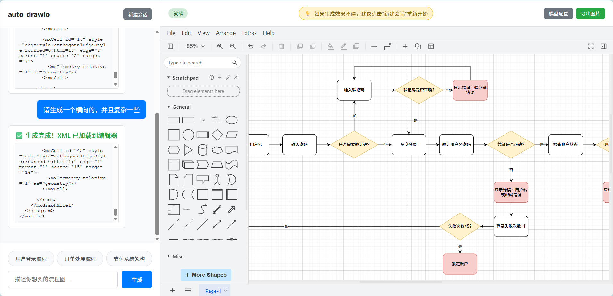

# Auto-Drawio

<div align="center">

**🎨 AI 驱动的智能流程图生成器**

一个基于 AI 的自动化流程图生成工具，支持通过自然语言描述快速创建专业的 Draw.io 流程图。


[功能特性](#-功能特性) • [快速开始](#-快速开始) • [部署指南](#-部署指南) • [使用说明](#-使用说明) • [常见问题](#-常见问题)

</div>

---

## 📖 项目简介

Auto-Drawio 是一个创新的流程图生成工具，它结合了大语言模型的理解能力和 Draw.io 的强大绘图功能。用户只需用自然语言描述想要的流程图，AI 就会自动生成专业的可编辑流程图。

体验地址  http://autodrawio.cherrybloom.top/

<div align="center">

</div>


## 🚀 快速开始

### 前置要求

**方式一：常规部署**
- **Python 3.12+**
- **Node.js 16+** 和 **npm**

**方式二：Docker 部署（推荐）**
- **Docker**
- **Docker Compose**

### 快速启动

#### 方式一：Docker 一键启动（推荐）

```bash
# 1. 克隆项目
git clone https://github.com/ZhangQL2824/auto-drawio.git
cd auto-drawio

# 2. 一键启动（自动构建前后端）
docker-compose up -d

# 3. 访问应用
# 浏览器打开 http://localhost:8000
```

#### 方式二：常规启动

```bash
# 1. 克隆项目
git clone https://github.com/ZhangQL2824/auto-drawio.git
cd auto-drawio

# 2. 启动后端服务
cd backend
pip install -r requirements.txt
cp .env.example .env
# 编辑 .env 文件填入 API 配置（可选，也可在前端配置）
python main.py
# 后端将运行在 http://localhost:8000

# 3. 启动前端服务（新开一个终端）
cd frontend
npm install
npm run dev
# 前端将运行在 http://localhost:5173

# 4. 访问应用
# 浏览器打开 http://localhost:5173
```

---

## 📦 部署指南

### 1. 配置后端

```bash
# 进入后端目录
cd backend

# 安装依赖
pip install -r requirements.txt

# 创建配置文件
cp .env.example .env
```

编辑 `.env` 文件（可选，也可以在前端界面配置）：

```env
# 默认 AI API 配置
DEFAULT_AI_NAME=Claude Sonnet 4.5
DEFAULT_AI_BASE_URL=https://api.anthropic.com/v1
DEFAULT_AI_API_KEY=your-api-key-here
DEFAULT_AI_MODEL=claude-sonnet-4-5-20250929

# 服务器配置
SERVER_HOST=0.0.0.0
SERVER_PORT=8000
```

### 2. 配置前端

```bash
# 进入前端目录
cd frontend

# 安装依赖
npm install
```

### 3. 启动服务

#### 开发环境

**后端服务（8000端口）：**

```bash
# 在 backend 目录下
python main.py

# 或使用 uvicorn
uvicorn main:app --reload --host 0.0.0.0 --port 8000
```

**前端服务（5173端口）：**

```bash
# 在 frontend 目录下
npm run dev
```

访问地址：`http://localhost:5173`

#### 生产环境

**步骤1：构建前端**

```bash
# 在 frontend 目录下
npm run build
# 构建产物将生成在 frontend/dist/ 目录
```

**步骤2：部署后端**

```bash
# 在 backend 目录下，后台运行
nohup uvicorn main:app --host 0.0.0.0 --port 8000 > server.log 2>&1 &

# 查看日志
tail -f server.log

# 停止服务
ps aux | grep uvicorn
kill <进程ID>
```

**步骤3：部署前端**

方式一：使用 Nginx 部署（推荐）

```nginx
# Nginx 配置示例
server {
    listen 80;
    server_name your-domain.com;

    # 前端静态文件
    root /path/to/auto-drawio/frontend/dist;
    index index.html;

    location / {
        try_files $uri $uri/ /index.html;
    }

    # 代理后端 API
    location /api {
        proxy_pass http://localhost:8000;
        proxy_set_header Host $host;
        proxy_set_header X-Real-IP $remote_addr;
    }
}
```

方式二：使用前端预览服务器

```bash
# 在 frontend 目录下
npm run preview -- --host 0.0.0.0 --port 80
```

访问地址：`http://your-server-ip`

### 4. 使用 Docker 部署（推荐）

Docker 部署方式最简单快捷，自动完成前端构建和后端部署，无需手动安装依赖。

#### 前置要求

- Docker
- Docker Compose

#### 快速启动

```bash
# 1. 配置环境变量（可选，也可在前端界面配置）
cp backend/.env.example backend/.env
# 编辑 backend/.env 填入你的 AI API 配置

# 2. 一键启动（自动构建前端+后端）
docker-compose up -d

# 3. 查看日志
docker-compose logs -f

# 4. 访问应用
# 浏览器打开 http://localhost:8000
```

#### 使用 80 端口（生产环境）

修改 `docker-compose.yml` 中的端口映射：

```yaml
ports:
  - "80:8000"  # 将主机 80 端口映射到容器 8000 端口
```

然后启动：

```bash
docker-compose up -d
# 访问: http://your-server-ip
```

#### 常用命令

```bash
# 停止服务
docker-compose down

# 重启服务
docker-compose restart

# 代码更新后重新构建
docker-compose down
docker-compose build --no-cache
docker-compose up -d

# 查看运行状态
docker-compose ps
```

#### Docker 部署优势

- ✅ **一键部署**：自动构建前端和后端，无需手动配置
- ✅ **环境隔离**：容器化运行，避免环境冲突
- ✅ **多阶段构建**：优化镜像大小（约 200-300 MB）
- ✅ **健康检查**：自动监控服务状态
- ✅ **易于维护**：简化更新和回滚流程

**详细的 Docker 部署文档请参考：[DOCKER_DEPLOY.md](DOCKER_DEPLOY.md)**

### 5. 项目特点

- ✅ **前后端分离**：Vue 3 前端 + FastAPI 后端，架构清晰
- ✅ **内置编辑器**：集成 Draw.io，无需外部依赖
- ✅ **灵活部署**：支持开发、生产、Docker 多种部署方式
- ✅ **容器化部署**：支持 Docker 一键部署，简化运维

---

## 🔧 配置 AI 模型

### 方式一：通过前端界面配置（推荐）

1. 启动应用后，点击右上角 **"模型配置"** 按钮
2. 点击 **"+ 添加新配置"**
3. 填写配置信息：
   - **配置名称**：例如 "OpenAI GPT-4"
   - **API 基础 URL**：例如 `https://api.openai.com/v1`
   - **API 密钥**：您的 API Key
   - **模型名称**：例如 `gpt-4`
4. 点击 **"保存"**
5. 点击 **"启用"** 按钮激活该配置

### 方式二：通过 .env 文件配置

编辑 `backend/.env`：

```env
DEFAULT_AI_NAME=OpenAI GPT-4
DEFAULT_AI_BASE_URL=https://api.openai.com/v1
DEFAULT_AI_API_KEY=sk-your-api-key-here
DEFAULT_AI_MODEL=gpt-4
```

### 支持的 AI 模型

理论上支持任何兼容 OpenAI API 格式的大语言模型：

- **OpenAI**：GPT-4, GPT-3.5
- **Anthropic**：Claude Sonnet, Claude Opus
- **国内大模型**：
  - 通义千问（阿里云）
  - 文心一言（百度）
  - 智谱 GLM（智谱 AI）
  - DeepSeek
- **本地模型**：Ollama, LocalAI 等

---

## 📝 使用说明

### 基本使用流程

1. **描述需求**：在左侧输入框输入流程图描述

   ```
   示例：
   - "生成一个用户登录流程图"
   - "创建一个电商订单处理流程"
   - "设计一个支付系统架构图"
   ```

2. **生成流程图**
   - 点击 **"生成"** 按钮
   - 或点击底部的 **快捷提问按钮**

3. **实时查看**
   - 左侧聊天区显示流式输出的 XML 代码
   - 生成完成后，右侧自动加载流程图

4. **编辑调整**
   - 在右侧 Draw.io 编辑器中自由编辑
   - 拖拽节点、修改文本、调整样式

5. **导出保存**
   - 点击右上角 **"导出图片"** 按钮
   - 选择格式：PNG / JPG / SVG
   - 自动下载到本地

### 快捷提问

点击底部快捷按钮，一键生成：
- **用户登录流程**
- **订单处理流程**
- **支付系统架构**

### 持续优化

支持基于当前流程图的持续对话：

```
- "把登录框加大一点"
- "添加一个忘记密码的分支"
- "将支付成功后的流程补充完整"
```

### 新建会话

如果生成效果不佳，点击左上角 **"新建会话"** 按钮，清空对话历史后重新开始。

💡 **提示**：右侧顶部有温馨提示："如果生成效果不佳，建议点击'新建会话'重新开始"

---

## 📂 项目结构

```
auto-drawio/
├── frontend/               # Vue 3 前端项目
│   ├── src/               # 源代码目录
│   │   ├── components/    # Vue 组件
│   │   │   ├── ChatPanel.vue        # 聊天面板
│   │   │   ├── EditorPanel.vue      # Draw.io 编辑器面板
│   │   │   ├── SettingsModal.vue    # 模型配置弹窗
│   │   │   └── TemplateModal.vue    # 模板选择弹窗
│   │   ├── composables/   # 组合式函数
│   │   │   └── useAI.js            # AI 调用逻辑
│   │   ├── stores/        # Pinia 状态管理
│   │   │   ├── config.js           # 配置状态
│   │   │   ├── conversation.js     # 对话状态
│   │   │   ├── editor.js           # 编辑器状态
│   │   │   └── template.js         # 模板状态
│   │   ├── App.vue        # 根组件
│   │   ├── main.js        # 应用入口
│   │   └── style.css      # 全局样式
│   ├── public/            # 静态资源
│   ├── index.html         # HTML 模板
│   ├── package.json       # 项目依赖
│   └── vite.config.js     # Vite 配置
├── backend/               # FastAPI 后端
│   ├── main.py           # FastAPI 主程序
│   ├── requirements.txt  # Python 依赖
│   ├── .env.example      # 环境变量示例
│   └── .env             # 环境变量配置（需自行创建）
├── README.md             # 项目文档
└── .gitignore           # Git 忽略文件
```

---

## ❓ 常见问题

### 1. Draw.io 编辑器无法加载

**问题**：右侧编辑器显示空白

**解决方案**：
- ✅ 检查浏览器控制台是否有错误
- ✅ 尝试清除浏览器缓存后刷新
- ✅ 更换浏览器（推荐 Chrome/Edge）

### 2. 生成失败或效果差

**问题**：AI 无法生成或生成的流程图不理想

**解决方案**：
- ✅ 检查 AI API 配置是否正确
- ✅ 确认 API Key 有效且有额度
- ✅ 点击 **"新建会话"** 清空历史
- ✅ 使用更详细的描述
- ✅ 切换到其他 AI 模型

### 3. 前端无法连接后端

**问题**：生成时提示网络错误

**解决方案**：
- ✅ 确认后端服务已启动
- ✅ 检查防火墙是否阻止端口
- ✅ 访问 `/docs` 测试后端 API

### 4. 导出图片失败

**问题**：点击导出图片无反应

**解决方案**：
- ✅ 确保已生成流程图
- ✅ 检查浏览器控制台错误
- ✅ 更换浏览器（推荐 Chrome/Edge）

---

## 🌐 关于 Draw.io 集成

本项目已内置 Draw.io 编辑器，无需安装 Docker 或任何额外软件。

**优点**：
- ✅ 零配置，开箱即用
- ✅ 完全离线可用，无需网络连接
- ✅ 快速加载，无外部依赖

---

## 📄 许可证

本项目采用 MIT 许可证。详见 [LICENSE](LICENSE) 文件。

**第三方组件：**
- Draw.io - Apache v2 许可证
- FastAPI - MIT 许可证

---

## 🙏 致谢

- [Smart Excalidraw Next](https://github.com/liujuntao123/smart-excalidraw-next) - 本项目受此项目启发而创建，感谢其优秀的创意和实现
- [Draw.io](https://github.com/jgraph/drawio) - 强大的开源绘图工具
- [FastAPI](https://fastapi.tiangolo.com/) - 现代化的 Python Web 框架
- 所有贡献者和使用者 ❤️

---

## 🔗 相关项目

- [Smart Excalidraw Next](https://github.com/liujuntao123/smart-excalidraw-next) - 基于 AI 的智能手绘风格流程图生成工具

---

## 📧 联系方式

- 微信联系：扫描下方二维码添加微信好友（昵称：在逃淀粉肠）

<div align="center">

</div>

---

<div align="center">

**⭐ 如果这个项目对您有帮助，请给我们一个 Star！**

Made with ❤️ by 在逃淀粉肠

[⬆ 返回顶部](#auto-drawio)

</div>
